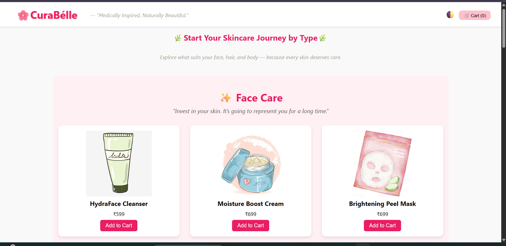
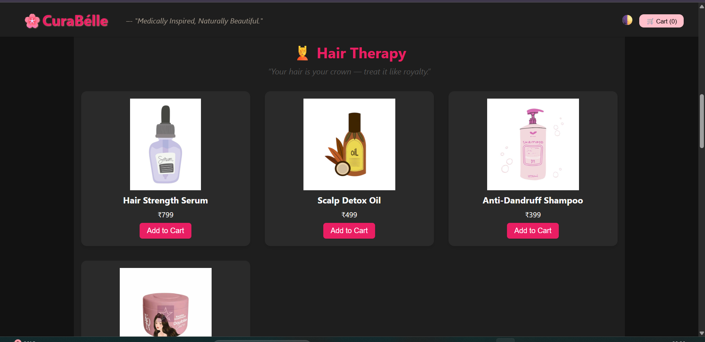
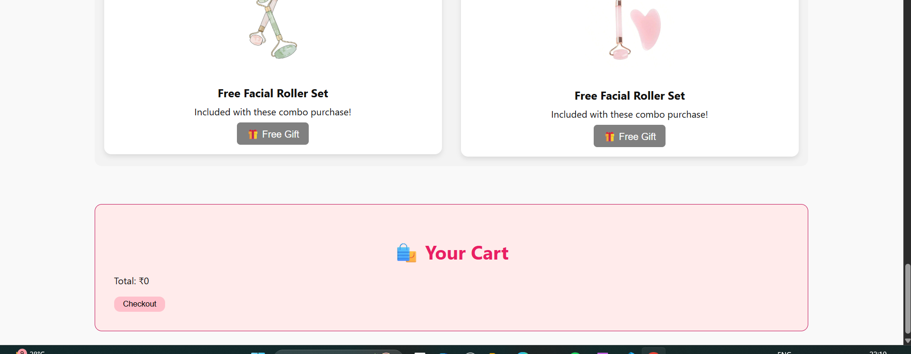
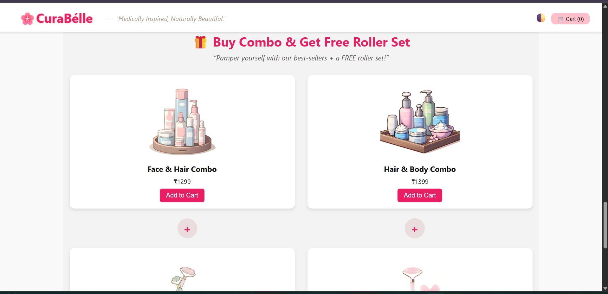

# 🌿 Curabélle – Medically Inspired, Naturally Beautiful.

**Curabélle** is a static skincare e-commerce website that showcases curated product categories for face, hair, and body wellness. Designed with a clean layout, themed visuals, and motivational taglines, it brings together nature and medical care for a seamless user experience.

---

## 🔥 Live Demo

🔗 [View Website](https://manjot-git.github.io/BrainwaveTask2/)  

---

## ✨ Features

- 💄 **Face, Hair & Body Care Sections** – Neatly categorized product cards.
- 🛒 **Cart System** – Add items with live count & total price calculation.
- 🎁 **Combo Offer Section** – Buy combos and receive a **free facial roller**.
- 🌙 **Theme Toggle** – Switch between light & dark mode.
- 📜 **Motivational Quotes** – Uplifting lines between product sections.
- 💅 **Responsive Design** – Scrollable, mobile-friendly layout.

---

## 📸 Screenshots 

<table>
  <tr>
    <td align="center">
      
      
<strong>🌿 Home Page</strong>

    </td>
    <td align="center">
      
      
<strong>🌙 Dark Theme Product Listing</strong>

    </td>
  </tr>
  <tr>
    <td align="center">
      
      
<strong>🛒 Cart Section</strong>

    </td>
    <td align="center">
      
      
<strong>🎁 Combo Offer</strong>

    </td>
  </tr>
</table>

---

## 🧪 Tech Stack

---

This was for internship Activity.
